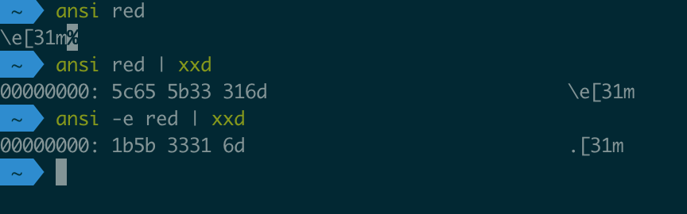
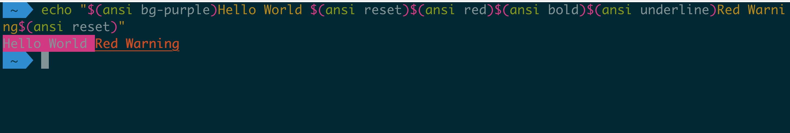
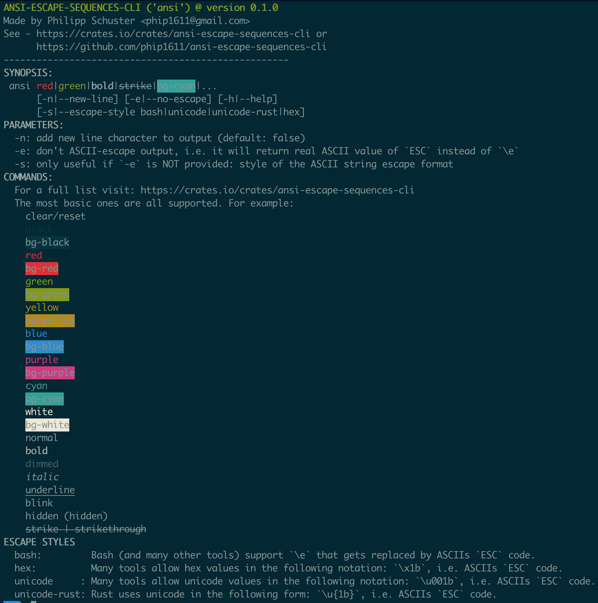

# 'ansi' - a CLI utility to quickly get ANSI escape codes
This Rust project called `ansi-escape-sequences-cli` provides an executable called `ansi`
which can be used on the Terminal to easily colorize/style your output.

## Install
`$ cargo install ansi-escape-sequences-cli` (the binary is just called `ansi`!)

## What it returns (you can copy&paste the value!)
Explanation:
1) returns the sequence in a "regular characters only"-form (for copy & paste),
   i.e. the `ESC`-code is escaped
2) same, but seen on the byte-level
3) returns the ESC-code directly, unescaped (harder to copy%paste)



## Usage example 1: in Terminal
`$ echo "$(ansi bg-purple)Hello World $(ansi reset)$(ansi red)$(ansi bold)$(ansi underline)Red Warning$(ansi reset)"` 


  
## Usage example 2: multiple uses in a bash script
test.sh
```bash
# with "-e" we can prevent unnecessary ASCII-escaping of the "ESC" symbol
# otherwise it can happen that your shell script outputs 
# "Foo=\e[31mbar" instead of the colored/styled output you wanted
reset=$(ansi -e reset)
red=$(ansi -e red)
echo "Foo=${red}bar"
echo "Bar=${reset}foo"
```

## zsh auto completion file
In `res/zsh-completion/_ansi` is a completion file. Install it for example into
`/usr/local/share/zsh/site-functions/`.

## How does it differ from `tput`?
It is simpler and you can use color names like `green` and `red`.
In `tput` you need to know the color indices, like here:
https://unix.stackexchange.com/questions/269077/tput-setaf-color-table-how-to-determine-color-codes

## Options/Parameters

*1:1 copy of "help"-page*
```text
ANSI-ESCAPE-SEQUENCES-CLI ('ansi') @ version 0.1.1
Made by Philipp Schuster <phip1611@gmail.com>
See - https://crates.io/crates/ansi-escape-sequences-cli or
      https://github.com/phip1611/ansi-escape-sequences-cli
----------------------------------------------------
SYNOPSIS:
 ansi red|green|bold|strike|bg-cyan|... 
      [-n|--new-line] [-e|--no-escape] [-h|--help]
      [-s|--escape-style bash|unicode|unicode-rust|hex]
PARAMETERS:
  -n: add new line character to output (default: false)
  -e: don't escape 'ESC'-symbol, i.e. return the real ASCII value of `ESC` instead of `\e`
  -s: only useful if `-e` is NOT provided: style of the `ESC`-character-escaping
COMMANDS:
  For a full list visit: https://crates.io/crates/ansi-escape-sequences-cli
  The most basic ones are all supported. For example:
    reset
    black
    bg-black
    red
    bg-red
    green
    bg-green
    yellow
    bg-yellow
    blue
    bg-blue
    purple
    bg-purple
    cyan
    bg-cyan
    white
    bg-white
    normal
    bold
    dimmed
    italic
    underline
    blink
    hidden (hidden)
    strike | strikethrough
ESCAPE STYLES
  bash:         Bash (and many other tools) support `\e` as escaped version of `ESC` code
  hex:          Many tools allow hex values in the following notation: `\x1b`, i.e. an escaped version of `ESC` code.
  unicode     : Many tools allow unicode values in the following notation: `\u001b`, i.e. an escaped version of `ESC` code.
  unicode-rust: Rust uses unicode in the following form: `\u{1b}`, i.e. an escaped version of `ESC` code.
```

## FAQ/Troubleshooting
### red is not red, blue is not blue
Your Terminal app may uses a theme that doesn't follow the convention/specification for ANSI escape sequences
and the corresponding colors. See https://handwiki.org/wiki/ANSI_escape_code#Colors for example. There nothing
that this utility can do in these cases to prevent "wrong colors" by "non standard" themes.
